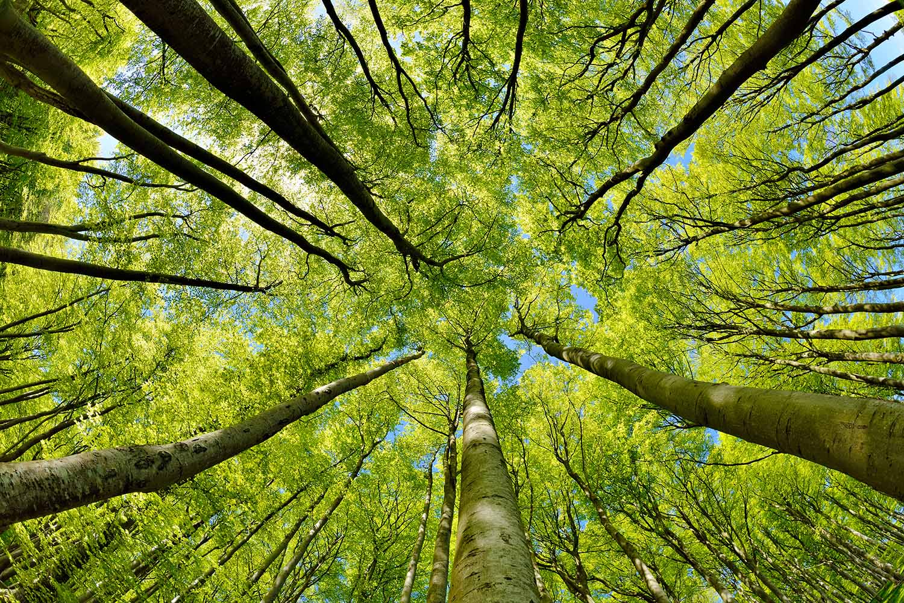

# Forest Ecology with Lab

## Biology 4018

## Lecture M/F 10:30 - 11:30 am
## Lab W 10:30 - 4:00 pm (extended lab)

## Dr. Erika Barthelmess

## Description

Of the habitable land on earth, approximately 38% is forested. Forests are important for human welfare because they are responsible for provisioning food, cleaning air, recycling nutrients, storing carbon, and other services. In addition, forests provide homes for millions of species. In this course we will examine forest ecosystems to learn what makes them "tick." We will study the major forest types of the world and compositional, structural and functional properties of forest ecosystems. This class meets from 10:30 - 11:30 on M and F and from 10:30 - 4 on Wednesdays. We will make use of extended lab periods to conduct inventories of a number of forests in our region to compare with one another and to examine how they have changed over time. Students will also learn to use the R statistical programming language to analyze forest data sets. This is a 300-level course that fulfills the Advanced Ecology requirement for the Conservation Biology major and is open to any student who has taken Biology 221 (Ecology).

## Pre-requisites: Biology 101 and Biology 102 and Biology 221 (Ecology)

# Registration is by Permission of Instructor so reach out to barthelmess@stlawu.edu if you want to enroll.

## Have questions? [email me!](mailto:barthelmess@stlawu.edu?subject=question%20about%20biostats)

